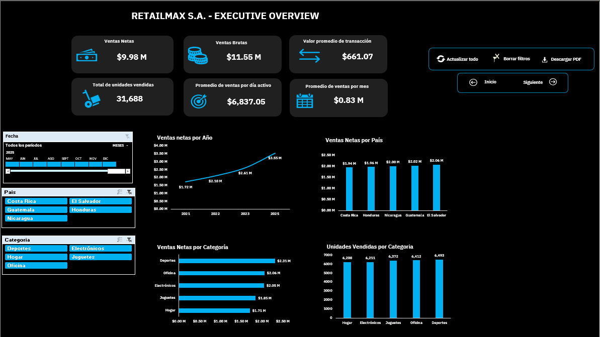
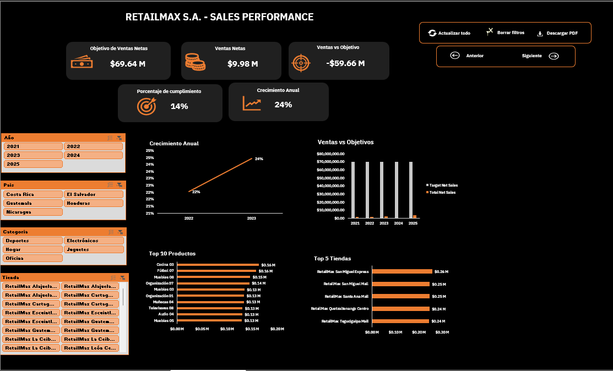
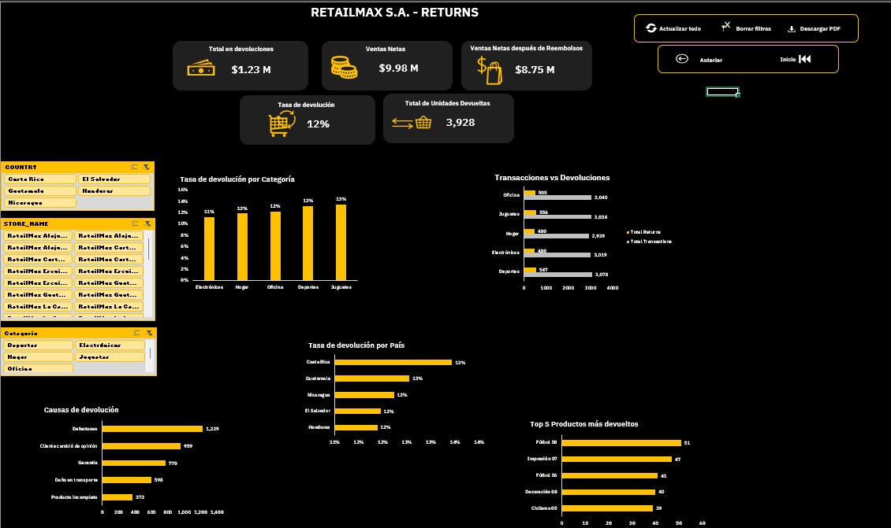

# 📈💲RetailMax S.A. - Sales Analytics Dashboard
Proyecto de análisis de la empresa RetailMax S.A. que evalúa la evolución de la empresa durante el periodo 2021-2025 en las áreas de ventas, rendimiento comercial y devoluciones,
mediante tres dashboards interactivos que permiten una visualización integral del desempeño del negocio.
El proyecto incluye procesos de limpieza y transformación de datos (ETL), modelado con jerarquías, creación de medidas DAX, desarrollo de dashboards e implementación de automatizaciones con VBA,
utilizando Excel, Power Query, Power Pivot y VBA.

## 📌Objetivo
Desarrollar una solución de Business Intelligence en Microsoft Excel que integre, limpie, transforme y modele información proveniente de múltiples fuentes de datos de ventas, objetivos y
devoluciones, con el fin de construir tres dashboards interactivos que faciliten el análisis del negocio y apoyen la toma de decisiones estratégicas para el crecimiento comercial de RetailMax S.A.

## 🛠️Tecnologías utilizadas
- Microsoft Excel
- Power Query
- Power Pivot
- DAX
- VBA

## ⭐Modelo de datos
El proyecto utiliza un modelo de datos estrella (Star Schema), compuesto por tablas de hechos como FactVentas, FactDevoluciones y FactObjetivos, y tablas de dimensión como DimProducto,
DimTienda, DimCliente, Calendario, DimPais y DimCategoria.

Después de identificar las llaves primarias (Primary Keys) en las tablas de dimensión y las llaves foráneas (Foreign Keys) en las tablas de hechos se establecieron relaciones uno a muchos (1:N),
donde el lado 1 corresponde a la tabla de dimensión y el lado N a la tabla de hechos.

Este tipo de modelado permite que los filtros aplicados sobre las dimensiones (por ejemplo, Año, País, Categoría o Tienda) se propaguen hacia las tablas de hechos facilitando el cálculo de 
medidas DAX y el análisis desde múltiples perspectivas.

Para este proyecto, todas las relaciones fueron implementadas con cardinalidad 1:N, siguiendo las buenas prácticas del modelo dimensional.

## 📶Dashboards
### 🔍Executive Overview
Este dashboard presenta una visión general del desempeño comercial de RetailMax S.A. durante el período 20221-2025 mostrando indicadores clave como ventas brutas, ventas netas, unidades vendidas y
el valor promedio por transacción.

Permite responder preguntas de negocio como:
- ¿Cuánto se ha vendido?
- ¿Cómo se distribuyen las ventas por país?
- ¿Cuántas unidades se han vendido?
- ¿Cuál ha sido el comportamiento de las ventas a lo largo del tiempo?

Para facilitar el análisis, incorpora segmentadores por País y Categoría, además de una línea de tiempo que permite filtrar la información por años, meses y períodos específicos.

La información se presenta mediante distintos tipos de visualización:
- Gráfico de líneas con jerarquía para analizar la evolución de las ventas por año y meses.
- Gráfico de columnas con jerarquía para comparar las ventas netas entre países, ciudades y tiendas.
- Gráfico de barras con jerarquía para explorar las ventas por categoría, subcategoría y productos mediante drill-down.
- Gráfico de columnas con jerarquía para visualizar la cantidad de unidades vendidas por cada categoría, subcategoría y producto.

### 💵Sales Performance
Este dashboard proporciona una visión integral del rendimiento comercial de RetailMAX S.A. durante el período 2021-2025, comparando las metas de ventas establecidas para cada año con el desempeño
real de la empresa a nivel de país, categoría y tienda.

El análisis se apoya en indicadores clave como:
- Objetivo de ventas netas.
- Ventas netas.
- Variación entre ventas netas y objetivo.
- Porcentaje de cumplimiento.
- Crecimiento interanual (YoY Growth) correspondiente al último año con datos disponibles.

Para facilitar el análisis interactivo, incorpora segmentadores por Año, País, Categoría y Tienda.

Además, incluye las siguientes visualizaciones:
- Gráfico de líneas para analizar la tendencia del crecimiento anual entre los años con información disponible.
- Gráfico de columnas agrupadas para comparar el objetivo de ventas netas frente a las ventas netas obtenidas en cada año.
- Gráfico de barras horizontales con el Top 10 de los productos con mayor volumen de ventas netas.
- Gráfico de barras horizontales con el Top 5 de las tiendas con mejor desempeño en ventas netas.

Con ayuda de estos indicadores y visualizaciones el dashboard permite responder preguntas como:
- ¿Se cumplieron los objetivos de ventas?
- ¿Cuánto crecieron o disminuyeron las ventas respecto al año anterior?
- ¿Cuáles fueron los productos con mejor desempeño?
- ¿Qué tiendas generan el mayor volumen de ventas?

### 🔁Returns Analysis
Este dashboard proporciona una visión detallada del comportamiento de las devoluciones de RetailMax S.A. durante el período de análisis, permitiendo evaluar su impacto sobre las ventas a nivel de 
país, ciudad, tienda, categoría, subcategoría y producto.

El análisis se apoya en indicadores clave como:
- Total reembolsado.
- Ventas netas.
- Ventas netas después de reembolsos.
- Tasa de devolución.
- Total de unidades devueltas.

Para facilitar el análisis interactivo, el dashboard incorpora segmentadores por: País, Tienda y Categoría.

Además, incluye las siguientes visualizaciones:
- Gráfico de columnas con jerarquía para analizar la tasa de devolución por categoría, subcategoría y producto mediante drill-down.
- Gráfico de barras horizontales para comparar el volumen de transacciones totales frente a las transacciones que finalizaron en devolución.
- Gráfico de barras horizontales con jerarquía para analizar la tasa de devolución por país, ciudad y tienda.
- Gráfico de barras horizontales para visualizar la cantidad de unidades devueltas según cada motivo de devolución.
- Gráfico de barras horizontales con el Top 5 de los productos con mayor volumen de devoluciones.

En conjunto estos elementos permiten responder preguntas como:
- ¿Cuál es la tasa de devolución por país?
- Cuál ha sido el monto total reembolsado?
- ¿Cuánto representan las ventas netas después de los reembolsos?
- ¿Cuál es el principal motivo de devolución?
- ¿Cuántas transacciones finalizaron en una devolución?
- ¿Qué productos presentan el mayor volumen de devoluciones?

Este análisis permite identificar oportunidades de mejora en la calidad de los productos, los procesos de venta y la experiencia del cliente, apoyando la toma de decisiones orientadas a reducir las
devoluciones y mejorar la rentabilidad del negocio.

## ⚙️Funcionalidades
- Segmentadores dinámicos
- KPIs
- Navegación ente dashboards
- Exportación a PDF
- Actualización automática
- Restablecimiento de filtros

## 🗂️Estructura del proyecto
El proyecto esta estructurado dentro de una carpeta principal dentro de la cual se encuentra la carpeta RetailMax_Etapa_1 que contiene los archivos de hechos FactObjetivos y FactDevoluciones, así
como los archivo dimensión DimCliente, DimEmpleado, DimTienda, DimProducto y DimFecha. Las cuales posteriormente se exportaron a Power Query para el respectivo proceso de limpieza y transformación.
Se crearon consultas como Calendario, Dimcategoría y DimPais.

En la carpeta FactVentasFiles se encuentran los archivos que contienen las tablas de hechos de ventas de los años 2021 a 2025, donde se diseño una estructura de columnas para anexar todos los archivos,
encontrandonos con que el archivo 2024 no es integrable ya que presenta una estructura completamente distinta a las demás, inhabilitado su interpretación y por lo tanto su integración. Para no
generar interpretaciones erroneas se tomo la decisión de dejarlo fuera del análisis.

La carpeta images contiene las capturas de los 3 dashboards presentados, el borrador del modelo estrella (star schema) diseñado en draw io y el logo de la empresa RetailMax S.A.

Y el archivo donde todo se consolida, el libro de Excel que contiene los 3 dashboards, una hoja de introducción, paneles de control para navegar por el archivo y exportar a PDF.

## 📊Dashboards imágenes
- RetailMax S.A. - Exectuive Overview Dashboard

- RetailMax S.A. - Sales Performance Dashboard

- RetailMax S.A. - Returns Analysis

## 👩‍💻Autor
Jessica Saraí Martinez Galicia
